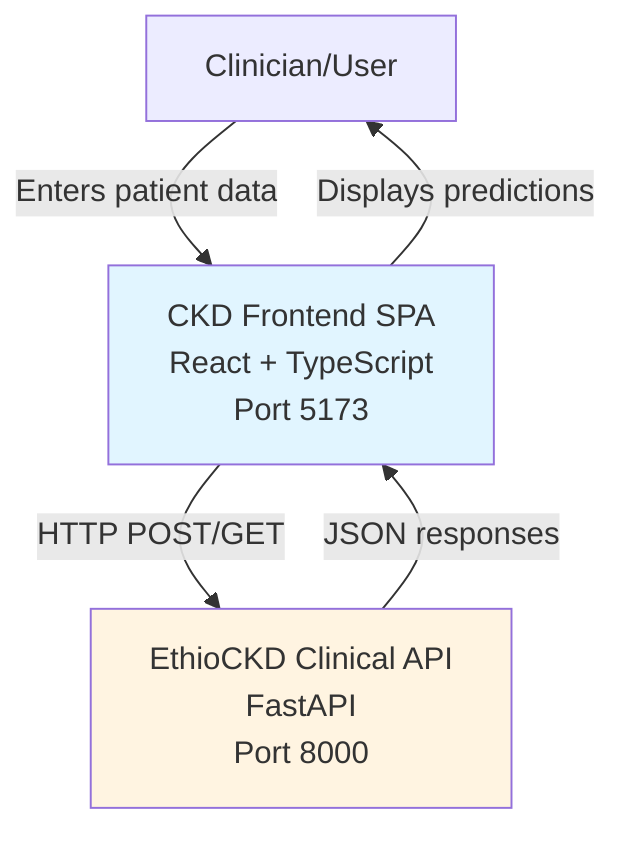
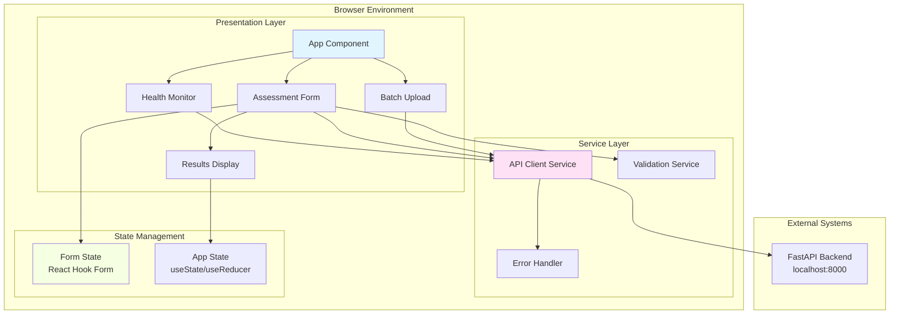

# Design Document: CKD Frontend

> **SUPERSEDED — historical documentation. Do not implement from this file.**
>
> Authoritative source: [FRONTEND_PLAN.md](../../../FRONTEND_PLAN.md).
> Why, section by section:
> [FRONTEND_REQUIREMENTS_RECONCILIATION.md](../../../FRONTEND_REQUIREMENTS_RECONCILIATION.md).
>
> Kept from this document: the ErrorBoundary pattern, the `APIError` / `ErrorHandler` layering,
> `sessionStorage`-never-`localStorage` for in-progress form data, the retry and
> graceful-degradation strategies, the four-tier test split and its reasoning about property-based
> testing, and Vite on port 5173.
>
> Rejected: "core functionality works without JavaScript" (false for an SPA), the tabbed
> single-page component hierarchy (now routed multi-page), and "React 18+" (React 19 is installed).

## Overview

The CKD Frontend is a React-based single-page application (SPA) that provides clinicians with a web interface for assessing chronic kidney disease (CKD) risk. The application connects to the existing EthioCKD Clinical API (FastAPI backend) to submit patient clinical data and display risk predictions with explainability information.

### Key Design Goals

1. **Clinical Workflow Optimization**: Minimize cognitive load for clinicians through clear visual hierarchies, logical grouping of clinical features, and scannable result displays
2. **Data Integrity**: Ensure accurate patient data entry through comprehensive validation that matches the backend schema
3. **Explainability**: Present SHAP-based model explanations in a clinically meaningful way that supports decision-making
4. **Resilience**: Handle network issues, API errors, and incomplete data gracefully
5. **Accessibility**: Support diverse clinical environments with responsive design and WCAG 2.1 AA compliance

### Technology Stack

- **Framework**: React 18+ with TypeScript for type safety
- **Build Tool**: Vite for fast development and optimized production builds
- **State Management**: React hooks (useState, useReducer) for local component state
- **HTTP Client**: Fetch API with custom wrapper for API communication
- **Styling**: CSS Modules or Tailwind CSS for scoped, maintainable styles
- **Form Library**: React Hook Form with Zod for declarative validation
- **Testing**: Vitest for unit tests, React Testing Library for component tests
- **Development Server**: Vite dev server on port 5173 (CORS pre-configured on backend)

### Architecture Principles

1. **Component-Based Architecture**: Decompose UI into reusable, testable components with clear responsibilities
2. **Unidirectional Data Flow**: State flows down through props, events bubble up through callbacks
3. **Separation of Concerns**: Separate API logic (services), UI logic (components), and validation logic (schemas)
4. **Error Boundaries**: Isolate failures to prevent cascading errors
5. **Progressive Enhancement**: Core functionality works without JavaScript enhancements

## Architecture

### System Context



### High-Level Architecture



### Component Hierarchy

```
App
├── HealthMonitor
│   └── StatusBanner
├── Header
│   └── ModelMetadata
├── MainLayout
│   ├── NavigationTabs
│   │   ├── SingleAssessmentTab
│   │   └── BatchUploadTab
│   ├── AssessmentForm
│   │   ├── FormSection (Demographics)
│   │   │   ├── NumericInput (age, bp)
│   │   │   └── CategoricalSelect (htn, dm, cad)
│   │   ├── FormSection (Lab Values)
│   │   │   └── NumericInput (sg, al, su, bgr, bu, sc, sod, pot, hemo, pcv, wc, rc)
│   │   ├── FormSection (Clinical Observations)
│   │   │   └── CategoricalSelect (rbc, pc, pcc, ba)
│   │   └── FormSection (Medical History)
│   │       └── CategoricalSelect (appet, pe, ane)
│   ├── LoadingSpinner
│   └── ResultsDisplay
│       ├── PredictionBadge
│       ├── RiskBandIndicator
│       ├── ScoreDisplay
│       ├── ImputationWarning
│       ├── ShapDriverList
│       │   └── ShapDriverItem
│       └── DisclaimerText
└── Footer
    └── ModelInfo
```

## Components and Interfaces

### Core Components

#### 1. App Component

**Responsibility**: Root component managing global state, health monitoring, and navigation

**State**:
```typescript
interface AppState {
  apiStatus: 'checking' | 'ok' | 'degraded' | 'offline';
  modelMetadata: ModelMetadata | null;
  currentView: 'single' | 'batch';
}
```

**Key Methods**:
- `initializeApp()`: Check API health and load model metadata on mount
- `handleViewChange(view: 'single' | 'batch')`: Switch between single and batch assessment modes

#### 2. HealthMonitor Component

**Responsibility**: Periodically check API health and display status to clinician

**Props**:
```typescript
interface HealthMonitorProps {
  onStatusChange: (status: ApiStatus) => void;
  checkInterval?: number; // default: 60000ms
}
```

**State**:
```typescript
interface HealthState {
  status: 'checking' | 'ok' | 'degraded' | 'offline';
  lastChecked: Date | null;
  healthData: HealthResponse | null;
}
```

**Key Methods**:
- `checkHealth()`: Send GET request to /health endpoint
- `scheduleNextCheck()`: Set up recurring health checks
- `renderStatusBanner()`: Display appropriate banner based on status

#### 3. AssessmentForm Component

**Responsibility**: Collect and validate patient clinical data

**Props**:
```typescript
interface AssessmentFormProps {
  onSubmit: (data: PatientAssessment) => Promise<void>;
  isDisabled: boolean;
}
```

**State** (managed by React Hook Form):
```typescript
type FormData = PatientAssessment; // Mirrors API schema
```

**Key Methods**:
- `handleSubmit()`: Validate form and call onSubmit prop
- `validateField(field: string, value: any)`: Real-time validation
- `resetForm()`: Clear all fields for new assessment
- `groupFields()`: Organize 24 fields into logical sections

**Validation Schema** (Zod):
```typescript
const patientAssessmentSchema = z.object({
  age: z.number().min(0).max(120).nullable(),
  bp: z.number().min(30).max(200).nullable(),
  sg: z.number().min(1.0).max(1.03).nullable(),
  al: z.number().min(0).max(5).nullable(),
  su: z.number().min(0).max(5).nullable(),
  bgr: z.number().min(0).max(600).nullable(),
  bu: z.number().min(0).max(400).nullable(),
  sc: z.number().min(0).max(80).nullable(),
  sod: z.number().min(0).max(200).nullable(),
  pot: z.number().min(0).max(50).nullable(),
  hemo: z.number().min(0).max(25).nullable(),
  pcv: z.number().min(0).max(60).nullable(),
  wc: z.number().min(0).max(30000).nullable(),
  rc: z.number().min(0).max(10).nullable(),
  rbc: z.enum(['normal', 'abnormal']).nullable(),
  pc: z.enum(['normal', 'abnormal']).nullable(),
  pcc: z.enum(['present', 'notpresent']).nullable(),
  ba: z.enum(['present', 'notpresent']).nullable(),
  htn: z.enum(['yes', 'no']).nullable(),
  dm: z.enum(['yes', 'no']).nullable(),
  cad: z.enum(['yes', 'no']).nullable(),
  appet: z.enum(['good', 'poor']).nullable(),
  pe: z.enum(['yes', 'no']).nullable(),
  ane: z.enum(['yes', 'no']).nullable(),
});
```

#### 4. FormSection Component

**Responsibility**: Group related form fields with section header

**Props**:
```typescript
interface FormSectionProps {
  title: string;
  description?: string;
  children: React.ReactNode;
  collapsible?: boolean;
}
```

#### 5. NumericInput Component

**Responsibility**: Reusable numeric input with validation and tooltips

**Props**:
```typescript
interface NumericInputProps {
  name: string;
  label: string;
  unit?: string; // e.g., "mmHg", "mg/dL"
  min: number;
  max: number;
  tooltip?: string;
  error?: string;
  value: number | null;
  onChange: (value: number | null) => void;
}
```

**Features**:
- Display validation errors inline
- Show valid range in placeholder
- Hover tooltip with clinical context
- Clear button to set null

#### 6. CategoricalSelect Component

**Responsibility**: Dropdown for categorical features

**Props**:
```typescript
interface CategoricalSelectProps {
  name: string;
  label: string;
  options: Array<{ value: string; label: string }>;
  tooltip?: string;
  error?: string;
  value: string | null;
  onChange: (value: string | null) => void;
}
```

**Features**:
- Include "Not provided" option (null value)
- Keyboard navigation support
- ARIA labels for accessibility

#### 7. ResultsDisplay Component

**Responsibility**: Show prediction results with SHAP explanations

**Props**:
```typescript
interface ResultsDisplayProps {
  prediction: PredictionResponse;
  onNewAssessment: () => void;
}
```

**Key Methods**:
- `renderPredictionBadge()`: Display CKD/Not CKD with visual distinction
- `renderRiskBand()`: Color-coded risk indicator
- `renderShapDrivers()`: List of top contributing features
- `renderImputationWarning()`: Highlight imputed fields if any
- `exportResults()`: Download results as PDF or CSV

#### 8. ShapDriverList Component

**Responsibility**: Visualize SHAP driver contributions

**Props**:
```typescript
interface ShapDriverListProps {
  drivers: ShapDriver[];
  maxDrivers?: number; // default: 5
}
```

**Key Methods**:
- `sortDrivers()`: Order by absolute impact
- `renderDriver(driver: ShapDriver)`: Individual driver visualization
- `getDirectionIcon(direction: string)`: Map direction to icon
- `getDirectionColor(direction: string)`: Map direction to color

**Visual Design**:
- Horizontal bar chart showing relative impact
- Red bars for raises_risk (↑)
- Green bars for lowers_risk (↓)
- Gray bars for neutral (—)
- Feature name, patient value, and direction indicator

#### 9. BatchUpload Component

**Responsibility**: Handle CSV file uploads for batch predictions

**Props**:
```typescript
interface BatchUploadProps {
  onUploadComplete: (results: BatchPredictionResponse) => void;
}
```

**State**:
```typescript
interface BatchUploadState {
  file: File | null;
  uploading: boolean;
  progress: number;
  results: BatchPredictionResponse | null;
  errors: Array<{ row: number; message: string }>;
}
```

**Key Methods**:
- `handleFileSelect(file: File)`: Validate CSV format
- `uploadFile()`: Send to /predict/batch endpoint
- `parseResults()`: Extract results from API response
- `exportResults()`: Download results as enhanced CSV

#### 10. LoadingSpinner Component

**Responsibility**: Display loading state during API requests

**Props**:
```typescript
interface LoadingSpinnerProps {
  message?: string;
  size?: 'small' | 'medium' | 'large';
}
```

### Service Layer

#### APIClient Service

**Responsibility**: Handle all HTTP communication with FastAPI backend

```typescript
class APIClient {
  private baseURL: string = 'http://localhost:8000';
  private timeout: number = 30000; // 30 seconds
  
  async checkHealth(): Promise<HealthResponse> {
    return this.get('/health');
  }
  
  async getModelMetadata(): Promise<ModelMetadata> {
    return this.get('/model');
  }
  
  async predictSingle(assessment: PatientAssessment): Promise<PredictionResponse> {
    return this.post('/predict', assessment);
  }
  
  async predictBatch(csvContent: string): Promise<BatchPredictionResponse> {
    return this.post('/predict/batch', csvContent, {
      headers: { 'Content-Type': 'text/csv' }
    });
  }
  
  private async get<T>(endpoint: string): Promise<T> {
    // Implementation with error handling
  }
  
  private async post<T>(endpoint: string, data: any, options?: RequestInit): Promise<T> {
    // Implementation with error handling
  }
  
  private handleError(error: any): never {
    // Map HTTP status codes to user-friendly messages
  }
}
```

**Error Mapping**:
- 200: Success
- 422: Validation error → Display field-specific errors
- 500: Server error → "The API encountered an error. Please try again."
- Timeout: → "The request timed out. Please check your connection and try again."
- Network error: → "Unable to reach the API. Please check your connection."

#### ValidationService

**Responsibility**: Provide reusable validation logic beyond schema validation

```typescript
class ValidationService {
  validateCSVFormat(file: File): { valid: boolean; errors: string[] } {
    // Check file extension, size, and basic structure
  }
  
  validatePatientAge(age: number): { valid: boolean; warning?: string } {
    // Check for clinically unusual ages (e.g., age < 18 or age > 100)
  }
  
  validateClinicalCoherence(data: PatientAssessment): string[] {
    // Check for clinically inconsistent combinations
    // e.g., high hemoglobin but also anemia marked as yes
  }
}
```

#### ErrorHandler

**Responsibility**: Centralize error handling and user messaging

```typescript
class ErrorHandler {
  handleAPIError(error: APIError): UserMessage {
    // Convert technical errors to user-friendly messages
  }
  
  handleValidationError(error: ValidationError): FieldErrors {
    // Map validation errors to specific form fields
  }
  
  logError(error: Error, context: string): void {
    // Log errors for debugging (console in dev, external service in prod)
  }
}
```

## Data Models

### Frontend Types (TypeScript)

```typescript
// Mirrors API PatientAssessment schema
interface PatientAssessment {
  age: number | null;
  bp: number | null;
  sg: number | null;
  al: number | null;
  su: number | null;
  bgr: number | null;
  bu: number | null;
  sc: number | null;
  sod: number | null;
  pot: number | null;
  hemo: number | null;
  pcv: number | null;
  wc: number | null;
  rc: number | null;
  rbc: 'normal' | 'abnormal' | null;
  pc: 'normal' | 'abnormal' | null;
  pcc: 'present' | 'notpresent' | null;
  ba: 'present' | 'notpresent' | null;
  htn: 'yes' | 'no' | null;
  dm: 'yes' | 'no' | null;
  cad: 'yes' | 'no' | null;
  appet: 'good' | 'poor' | null;
  pe: 'yes' | 'no' | null;
  ane: 'yes' | 'no' | null;
}

// Mirrors API PredictionResponse schema
interface PredictionResponse {
  prediction: 'ckd' | 'notckd';
  ckd_score: number;
  risk_band: 'LOW' | 'MODERATE' | 'HIGH';
  imputed_fields: string[];
  imputation_count: number;
  shap_drivers: ShapDriver[];
  explanation: string | null;
  model: ModelInfo;
  disclaimer: string;
}

// Mirrors API ShapDriver schema
interface ShapDriver {
  feature: string;
  value: number;
  direction: 'raises_risk' | 'lowers_risk' | 'neutral';
}

// Mirrors API HealthResponse schema
interface HealthResponse {
  status: 'ok' | 'degraded';
  model: string;
  preprocessor: string;
  shap: string;
  schema_compatible: boolean;
  feature_count: number | null;
  detail: string | null;
}

// Mirrors API BatchPredictionResponse schema
interface BatchPredictionResponse {
  count: number;
  results: BatchPredictionItem[];
}

interface BatchPredictionItem {
  prediction: 'ckd' | 'notckd';
  ckd_score: number;
  risk_band: 'LOW' | 'MODERATE' | 'HIGH';
  imputed_fields: string[];
  imputation_count: number;
  shap_drivers: ShapDriver[];
}

// Frontend-specific types
interface ModelInfo {
  name: string;
  version: string;
  accuracy?: number;
  recall?: number;
  precision?: number;
  training_date?: string;
}

interface ApiStatus {
  status: 'checking' | 'ok' | 'degraded' | 'offline';
  lastChecked: Date | null;
}

interface UserMessage {
  type: 'success' | 'error' | 'warning' | 'info';
  title: string;
  message: string;
}

interface FieldError {
  field: string;
  message: string;
}
```

### Field Metadata Configuration

```typescript
interface FieldMetadata {
  name: string;
  label: string;
  fullName: string;
  type: 'numeric' | 'categorical';
  unit?: string;
  min?: number;
  max?: number;
  options?: Array<{ value: string; label: string }>;
  section: 'demographics' | 'lab_values' | 'clinical_obs' | 'medical_history';
  tooltip: string;
}

const FIELD_METADATA: Record<string, FieldMetadata> = {
  age: {
    name: 'age',
    label: 'Age',
    fullName: 'Patient Age',
    type: 'numeric',
    unit: 'years',
    min: 0,
    max: 120,
    section: 'demographics',
    tooltip: 'Patient age in years (0-120)'
  },
  bp: {
    name: 'bp',
    label: 'BP',
    fullName: 'Blood Pressure',
    type: 'numeric',
    unit: 'mmHg',
    min: 30,
    max: 200,
    section: 'demographics',
    tooltip: 'Diastolic blood pressure in mmHg (30-200)'
  },
  // ... (complete for all 24 fields)
};
```

## Error Handling

### Error Categories and Handling Strategy

#### 1. Network Errors

**Scenarios**:
- API unreachable
- DNS resolution failure
- Connection timeout

**Handling**:
```typescript
catch (error) {
  if (error instanceof NetworkError) {
    showNotification({
      type: 'error',
      title: 'Connection Error',
      message: 'Unable to reach the API. Please check your network connection.',
      action: 'Retry'
    });
  }
}
```

#### 2. HTTP Errors

**Scenarios**:
- 422 Validation Error
- 500 Internal Server Error
- 503 Service Unavailable

**Handling**:
```typescript
catch (error) {
  if (error instanceof HTTPError) {
    switch (error.status) {
      case 422:
        // Map validation errors to form fields
        const fieldErrors = parseValidationErrors(error.body);
        setFormErrors(fieldErrors);
        break;
      case 500:
        showNotification({
          type: 'error',
          title: 'Server Error',
          message: 'The API encountered an error. Please try again.',
          action: 'Retry'
        });
        break;
      case 503:
        showNotification({
          type: 'warning',
          title: 'API Unavailable',
          message: 'The API is temporarily unavailable. Please try again later.'
        });
        break;
    }
  }
}
```

#### 3. Validation Errors

**Scenarios**:
- Invalid field values (out of range)
- Incorrect data types
- Required field missing (if any)

**Handling**:
- Display inline error message below field
- Prevent form submission
- Highlight invalid field with red border
- Show error count in submit button: "Fix 3 errors to submit"

#### 4. Application Errors

**Scenarios**:
- Component render errors
- State update errors
- Unexpected data format

**Handling**:
```typescript
class ErrorBoundary extends React.Component {
  componentDidCatch(error: Error, errorInfo: React.ErrorInfo) {
    logError(error, errorInfo);
    this.setState({ hasError: true });
  }
  
  render() {
    if (this.state.hasError) {
      return <ErrorFallback onReset={this.reset} />;
    }
    return this.props.children;
  }
}
```

### Error Recovery Strategies

1. **Automatic Retry**: For transient network errors, retry up to 3 times with exponential backoff
2. **Graceful Degradation**: If health check fails, allow user to proceed with warning
3. **Local State Preservation**: Save form data to sessionStorage to prevent data loss on errors
4. **Clear Error Messages**: Provide actionable guidance (e.g., "Check field X" not "Invalid input")
5. **Error Logging**: Log errors to console in development, send to monitoring service in production

## Testing Strategy

### Why Property-Based Testing is Not Applicable

Property-based testing (PBT) is **not appropriate** for this feature because:

1. **UI-Centric Feature**: The primary functionality involves UI rendering, layout, and visual feedback, which are better tested through snapshot tests and visual regression testing.

2. **External API Dependency**: Most critical workflows depend on the FastAPI backend, making them unsuitable for universal property testing. Integration tests with mocked API responses are more appropriate.

3. **Configuration and Setup**: Requirements like health checks, API status monitoring, and environment setup are one-time verifications, not universal properties across input spaces.

4. **Form Validation Already Handled**: Input validation is declaratively defined using Zod schemas, which provides compile-time type safety and runtime validation without needing property tests.

**Testing Approach**: This feature will use a combination of **unit tests** (for pure utility functions), **component tests** (for React components), **integration tests** (for user flows with mocked API), and **accessibility tests** (for WCAG compliance).

### Unit Tests

**Target**: Individual functions and hooks
**Tool**: Vitest
**Coverage Goal**: >80% for utility functions and services

**Examples**:
- `ValidationService.validateCSVFormat()`: Test valid and invalid CSV inputs
- `APIClient.handleError()`: Test error mapping for different HTTP status codes
- `formatShapDriver()`: Test formatting of SHAP driver data
- `formatRiskBand()`: Test color mapping for risk bands
- `parseValidationErrors()`: Test extraction of field errors from API 422 responses

**Test Template**:
```typescript
describe('ValidationService', () => {
  it('should reject CSV files with invalid extension', () => {
    const file = new File(['data'], 'test.txt', { type: 'text/plain' });
    const result = validationService.validateCSVFormat(file);
    expect(result.valid).toBe(false);
    expect(result.errors).toContain('File must have .csv extension');
  });
  
  it('should accept valid CSV files', () => {
    const file = new File(['age,bp\n25,120'], 'test.csv', { type: 'text/csv' });
    const result = validationService.validateCSVFormat(file);
    expect(result.valid).toBe(true);
  });
});
```

### Component Tests

**Target**: Individual React components
**Tool**: Vitest + React Testing Library
**Coverage Goal**: >70% for presentational components

**Examples**:
- `NumericInput`: Test validation, error display, value changes
- `CategoricalSelect`: Test option selection, keyboard navigation
- `ShapDriverList`: Test rendering of drivers with different directions
- `RiskBandIndicator`: Test color coding for LOW/MODERATE/HIGH
- `ImputationWarning`: Test display when imputation_count > 0

**Test Template**:
```typescript
describe('NumericInput', () => {
  it('should display validation error when value is out of range', () => {
    render(<NumericInput name="age" min={0} max={120} value={150} />);
    expect(screen.getByText(/value must be at most 120/i)).toBeInTheDocument();
  });
  
  it('should call onChange when value changes', () => {
    const handleChange = vi.fn();
    render(<NumericInput name="age" min={0} max={120} onChange={handleChange} />);
    fireEvent.change(screen.getByRole('spinbutton'), { target: { value: '25' } });
    expect(handleChange).toHaveBeenCalledWith(25);
  });
  
  it('should display unit label when provided', () => {
    render(<NumericInput name="bp" label="BP" unit="mmHg" min={30} max={200} />);
    expect(screen.getByText(/mmHg/i)).toBeInTheDocument();
  });
});
```

### Integration Tests

**Target**: Component interactions and data flow
**Tool**: Vitest + React Testing Library with MSW (Mock Service Worker)
**Coverage Goal**: Test critical user flows

**Examples**:
1. **Single Assessment Flow**:
   - Fill out form with valid data
   - Submit form
   - Verify API call with correct payload (mocked)
   - Display prediction results

2. **Validation Flow**:
   - Enter invalid data in multiple fields
   - Verify error messages appear for each field
   - Correct errors
   - Verify submit button becomes enabled

3. **Health Check Flow**:
   - Mock API offline response → Verify error banner displayed
   - Mock API degraded response → Verify warning banner displayed
   - Mock API ok response → Verify form enabled

4. **Batch Upload Flow**:
   - Select CSV file
   - Mock upload to /predict/batch endpoint
   - Display batch results table
   - Verify export functionality

**Test Template**:
```typescript
import { rest } from 'msw';
import { setupServer } from 'msw/node';

const server = setupServer(
  rest.post('http://localhost:8000/predict', (req, res, ctx) => {
    return res(ctx.json({
      prediction: 'ckd',
      ckd_score: 0.85,
      risk_band: 'HIGH',
      imputed_fields: ['age'],
      imputation_count: 1,
      shap_drivers: [],
      explanation: null,
      model: { name: 'test-model' },
      disclaimer: 'Test disclaimer'
    }));
  })
);

beforeAll(() => server.listen());
afterEach(() => server.resetHandlers());
afterAll(() => server.close());

describe('Assessment Flow', () => {
  it('should submit form and display results', async () => {
    render(<App />);
    
    // Fill form
    fireEvent.change(screen.getByLabelText(/age/i), { target: { value: '45' } });
    fireEvent.change(screen.getByLabelText(/bp/i), { target: { value: '140' } });
    
    // Submit
    fireEvent.click(screen.getByRole('button', { name: /submit/i }));
    
    // Wait for results
    await waitFor(() => {
      expect(screen.getByText(/CKD/i)).toBeInTheDocument();
      expect(screen.getByText(/HIGH/i)).toBeInTheDocument();
    });
  });
});
```

### End-to-End Tests (Optional)

**Target**: Full application workflows
**Tool**: Playwright or Cypress
**Coverage Goal**: Test critical paths in production-like environment

**Examples**:
- Complete single assessment with real backend
- Upload batch CSV and download results
- Navigate between single and batch modes
- Test responsive behavior at different viewport sizes

### Accessibility Tests

**Target**: WCAG 2.1 AA compliance
**Tool**: axe-core (via jest-axe or @axe-core/react)

**Examples**:
- Test color contrast ratios
- Verify keyboard navigation
- Check ARIA labels on form inputs
- Validate focus management
- Test screen reader announcements

**Test Template**:
```typescript
import { axe, toHaveNoViolations } from 'jest-axe';

expect.extend(toHaveNoViolations);

describe('AssessmentForm Accessibility', () => {
  it('should not have accessibility violations', async () => {
    const { container } = render(<AssessmentForm />);
    const results = await axe(container);
    expect(results).toHaveNoViolations();
  });
  
  it('should have proper ARIA labels on all inputs', () => {
    render(<AssessmentForm />);
    const ageInput = screen.getByLabelText(/age/i);
    expect(ageInput).toHaveAttribute('aria-label');
  });
});
```

### Performance Tests

**Target**: Measure rendering performance and bundle size
**Tool**: Lighthouse, Vite bundle analyzer

**Metrics**:
- First Contentful Paint (FCP) < 1.5s
- Time to Interactive (TTI) < 3s
- Total bundle size < 500KB (gzipped)
- Component render time < 16ms (60fps)

### Manual Testing Checklist

**Browser Compatibility**:
- [ ] Chrome (latest)
- [ ] Firefox (latest)
- [ ] Safari (latest)
- [ ] Edge (latest)

**Responsive Design**:
- [ ] Desktop (1920x1080)
- [ ] Laptop (1366x768)
- [ ] Tablet (768x1024)
- [ ] Mobile (375x667) - View only, not primary target

**Keyboard Navigation**:
- [ ] Tab through all form fields
- [ ] Submit form with Enter key
- [ ] Select dropdown options with arrow keys
- [ ] Clear fields with keyboard shortcuts

**Screen Reader**:
- [ ] Test with NVDA (Windows) or VoiceOver (Mac)
- [ ] Verify all form labels are read
- [ ] Verify error messages are announced

## Implementation Notes

### Project Structure

```
ckd-frontend/
├── public/
│   └── favicon.ico
├── src/
│   ├── components/
│   │   ├── common/
│   │   │   ├── Button.tsx
│   │   │   ├── LoadingSpinner.tsx
│   │   │   └── ErrorBoundary.tsx
│   │   ├── form/
│   │   │   ├── AssessmentForm.tsx
│   │   │   ├── FormSection.tsx
│   │   │   ├── NumericInput.tsx
│   │   │   └── CategoricalSelect.tsx
│   │   ├── results/
│   │   │   ├── ResultsDisplay.tsx
│   │   │   ├── PredictionBadge.tsx
│   │   │   ├── RiskBandIndicator.tsx
│   │   │   ├── ShapDriverList.tsx
│   │   │   └── ImputationWarning.tsx
│   │   ├── batch/
│   │   │   ├── BatchUpload.tsx
│   │   │   └── BatchResultsTable.tsx
│   │   └── health/
│   │       ├── HealthMonitor.tsx
│   │       └── StatusBanner.tsx
│   ├── services/
│   │   ├── api.ts
│   │   ├── validation.ts
│   │   └── error-handler.ts
│   ├── types/
│   │   ├── api.types.ts
│   │   ├── form.types.ts
│   │   └── common.types.ts
│   ├── utils/
│   │   ├── field-metadata.ts
│   │   ├── format.ts
│   │   └── storage.ts
│   ├── hooks/
│   │   ├── useHealthCheck.ts
│   │   ├── useFormValidation.ts
│   │   └── useAPIClient.ts
│   ├── styles/
│   │   ├── globals.css
│   │   ├── variables.css
│   │   └── components/
│   ├── App.tsx
│   ├── main.tsx
│   └── vite-env.d.ts
├── tests/
│   ├── unit/
│   ├── integration/
│   └── setup.ts
├── package.json
├── tsconfig.json
├── vite.config.ts
├── vitest.config.ts
└── README.md
```

### Build Configuration

**vite.config.ts**:
```typescript
import { defineConfig } from 'vite';
import react from '@vitejs/plugin-react';

export default defineConfig({
  plugins: [react()],
  server: {
    port: 5173,
    proxy: {
      '/api': {
        target: 'http://localhost:8000',
        changeOrigin: true,
        rewrite: (path) => path.replace(/^\/api/, ''),
      },
    },
  },
  build: {
    outDir: 'dist',
    sourcemap: true,
    rollupOptions: {
      output: {
        manualChunks: {
          vendor: ['react', 'react-dom'],
          forms: ['react-hook-form', 'zod'],
        },
      },
    },
  },
});
```

### Environment Configuration

**.env.development**:
```
VITE_API_BASE_URL=http://localhost:8000
VITE_API_TIMEOUT=30000
VITE_HEALTH_CHECK_INTERVAL=60000
```

**.env.production**:
```
VITE_API_BASE_URL=https://api.ethiockd.example.com
VITE_API_TIMEOUT=30000
VITE_HEALTH_CHECK_INTERVAL=120000
```

### Accessibility Implementation

1. **Semantic HTML**: Use `<form>`, `<label>`, `<button>` instead of `<div>` with click handlers
2. **ARIA Labels**: Add `aria-label` to all interactive elements
3. **Focus Management**: Ensure logical tab order, use `focus()` after form submission
4. **Color Contrast**: Ensure 4.5:1 contrast ratio for normal text, 3:1 for large text
5. **Keyboard Navigation**: Support Tab, Enter, Arrow keys, Escape
6. **Screen Reader Announcements**: Use `aria-live` regions for dynamic content updates

### Responsive Design Breakpoints

```css
/* Mobile-first approach */
/* Base styles: Mobile (< 768px) */

@media (min-width: 768px) {
  /* Tablet styles */
  .form-section {
    grid-template-columns: 1fr 1fr;
  }
}

@media (min-width: 1024px) {
  /* Desktop styles */
  .form-section {
    grid-template-columns: repeat(3, 1fr);
  }
}

@media (min-width: 1440px) {
  /* Large desktop styles */
  .main-layout {
    max-width: 1400px;
    margin: 0 auto;
  }
}
```

### Performance Optimizations

1. **Code Splitting**: Lazy load BatchUpload component (not always used)
   ```typescript
   const BatchUpload = React.lazy(() => import('./components/batch/BatchUpload'));
   ```

2. **Memoization**: Use `React.memo` for expensive components like ShapDriverList
   ```typescript
   export const ShapDriverList = React.memo(({ drivers }) => {
     // Component implementation
   });
   ```

3. **Debouncing**: Debounce validation for numeric inputs
   ```typescript
   const debouncedValidate = useMemo(
     () => debounce(validate, 300),
     []
   );
   ```

4. **Virtual Scrolling**: For batch results table with >100 rows, use react-virtual

5. **Image Optimization**: Use WebP format for icons, lazy load images

### Security Considerations

1. **Input Sanitization**: All user input is validated against schema before API submission
2. **XSS Prevention**: React escapes strings by default, avoid `dangerouslySetInnerHTML`
3. **HTTPS**: Use HTTPS in production, HTTP only for local development
4. **No Sensitive Data Storage**: Do not store patient data in localStorage (use sessionStorage if needed)
5. **Content Security Policy**: Set CSP headers to prevent injection attacks
6. **CORS**: Backend already configured for port 5173, verify in production

### Deployment

**Development**:
```bash
npm install
npm run dev  # Starts Vite dev server on port 5173
```

**Production Build**:
```bash
npm run build  # Creates optimized bundle in dist/
npm run preview  # Preview production build locally
```

**Docker Deployment** (Optional):
```dockerfile
FROM node:18-alpine AS build
WORKDIR /app
COPY package*.json ./
RUN npm ci
COPY . .
RUN npm run build

FROM nginx:alpine
COPY --from=build /app/dist /usr/share/nginx/html
COPY nginx.conf /etc/nginx/nginx.conf
EXPOSE 80
CMD ["nginx", "-g", "daemon off;"]
```

### Future Enhancements (Out of Scope)

1. **Authentication**: User login and role-based access control
2. **Patient History**: Store and retrieve past assessments
3. **Export Formats**: PDF reports, HL7 FHIR messages
4. **Internationalization**: Multi-language support
5. **Offline Mode**: Progressive Web App with offline capabilities
6. **Advanced Analytics**: Trends, population-level statistics
7. **Integration**: EHR system integration via HL7/FHIR
